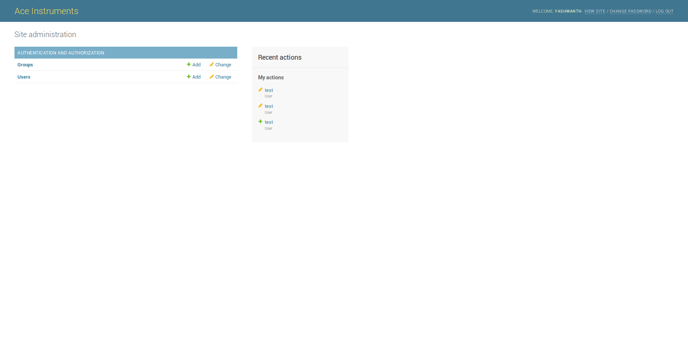
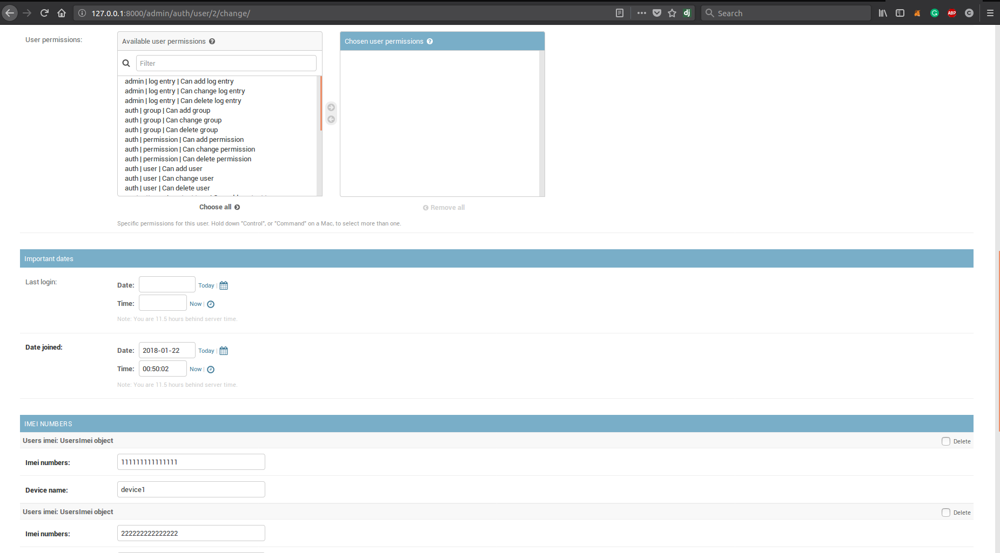

# ace
Ace is an dashboard built from opensouce bootstrap and Django-channels
It serves as a dashboard to view realtime data which is sent from IOT devices to the server.
The data is also saved in database for further analysis.

## Features

- Add users, groups and set permissions.
- Assign devices to users using IMEI number (or anything unique in your project), so that only users with permissions can see the data from the device.
- Fully customizable.
- Ready to Deploy.

## Installation and Setup

Download the code from this repository.

- Install Redis from https://redis.io/topics/quickstart
- Install the required libs using
<code>pip install -r requirements.txt</code>
- Change the database user name and password (mysql) as in your system in ace/settings.py
- create a database named ace
- Apply migrations to create tables
<code>python manage.py migrate</code>
- Create a super user using
<code>python manage.py createsuperuser</code>
- Start the server
<code>python manage.py runserver</code>
- In your browser visit http:localhost:8000
- Login uing the superuser credentials

## Testing 

- Create a user and add a devide with IMEI number
- In your dashboard you can see the devices, click device to see the realtime data
- In a different tab of your browser enter this, replacing the data accordingly 
- NOTE that IMEI should be same as you set to the user to receive data http://localhost:8000/data?Name=ACE%20INSTR&IMEI=222222222222222&Sstr=23&DevTime=29/10/16%2011:50:26&Temp=35.7&Hum=65
- you can see instant change in your data.

## TODO

- The graph is not live, it uses dummy data.

## Screenshots
### Login Screen

### Dashboard

### Realtime Data of device

### Administration

### More Settings

### Testing from browser

